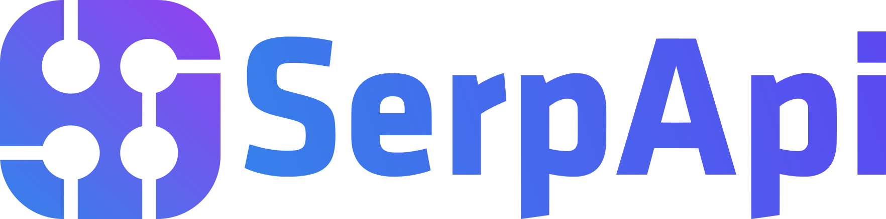

# 여웅이 Mem

`claude-mem` 을 개인 서버에서 직접 돌리는 포크. 대화 기록과 요약을
남의 서비스가 아니라 내 Postgres 에 쌓는다.

업스트림과 다른 점:

- **주기 요약** — 이벤트마다 provider 를 부르지 않고 N 분마다 한 번에
  묶어서 부른다. 무료 티어 한도가 한 세션에 소진되는 것을 막는다
- **모델 자동 전환** — 한 모델이 한도에 걸리면 다음 후보로 넘어가고,
  대시보드에서 모델을 직접 고를 수도 있다
- **한글 관측치** — 요약을 한글로 생성한다
- **한글 검색 + 의미 검색** — 조사를 떼서 검색하고, pgvector 임베딩으로
  단어가 겹치지 않아도 뜻이 비슷하면 찾는다
- **끊겨도 안 잃는다** — 서버가 죽으면 훅이 로컬에 쌓아뒀다 복구되면
  다시 보내고, 큐에서 유실된 잡은 서버가 주기적으로 다시 집어넣는다

---

## 자체 호스팅

### 1. 구성

컨테이너 4개가 뜬다.

| 컨테이너 | 역할 |
|---|---|
| `postgres` | 대화·관측치·잡 저장소. **정본** |
| `valkey` | BullMQ 큐 (Redis 호환) |
| `claude-mem-server` | HTTP API + 대시보드. 포트 `37877` |
| `claude-mem-worker` | 큐를 소비해 provider 를 호출하고 요약 생성 |

서버와 워커는 같은 이미지를 쓰고 역할만 다르다.

### 2. 서버 띄우기

```bash
git clone https://github.com/tt12b/claude-mem.git ~/claude-mem
cd ~/claude-mem
cp .env.example .env   # 아래 3번 참고해서 채운다
docker compose up -d
```

대시보드는 `http://<서버주소>:37877` 이다.

### 3. `.env`

`.env` 는 `docker-compose.yml` 과 **같은 디렉터리**에 둔다.

**반드시 채워야 하는 값** — 비어 있으면 컨테이너가 아예 뜨지 않는다.

```dotenv
POSTGRES_USER=claudemem
POSTGRES_PASSWORD=<임의의 긴 문자열>
POSTGRES_DB=claudemem
```

**요약 provider** — 하나는 있어야 요약이 만들어진다.

```dotenv
# Google AI Studio 키 (무료 티어). 임베딩도 이 키를 쓴다
GEMINI_API_KEY=<키>
CLAUDE_MEM_SERVER_PROVIDER=gemini

# 후보 모델을 콤마로 나열한다. 앞에서부터 시도하고
# 한도에 걸리면 다음 것으로 자동 전환된다
CLAUDE_MEM_SERVER_MODEL=gemini-3.5-flash-lite,gemini-3.1-flash-lite,gemini-3.6-flash,gemini-flash-latest

# 모델별 하루 요청 한도(공개 문서 기준 추정치).
# 실제로 429 를 받으면 그때 알려준 값으로 교정된다
CLAUDE_MEM_MODEL_LIMITS=gemini-3.5-flash-lite=1000,gemini-3.1-flash-lite=1000,gemini-3.6-flash=250,gemini-flash-latest=20
```

**요약 주기와 언어**

```dotenv
# 이벤트 1건당 provider 1회 호출은 무료 한도를 한 세션에 소진시킨다.
# false 로 두면 이벤트는 그대로 저장되고 아래 주기 요약이 한 번에 처리한다
CLAUDE_MEM_GENERATE_PER_EVENT=false

# 주기 요약 간격(분). 새 이벤트가 없는 세션은 잡을 만들지 않으므로
# 유휴 상태에서는 provider 호출이 0 이다. 0 이면 비활성
CLAUDE_MEM_SUMMARY_INTERVAL_MINUTES=10

CLAUDE_MEM_OBSERVATION_LANGUAGE=Korean
CLAUDE_MEM_USAGE_METERING=1
```

**의미 검색(pgvector)**

```dotenv
CLAUDE_MEM_EMBEDDINGS=true
CLAUDE_MEM_EMBEDDING_MODEL=gemini-embedding-001
CLAUDE_MEM_EMBEDDING_INTERVAL_MINUTES=5
```

pgvector 가 없는 Postgres 로 바꿔도 서버는 그대로 뜨고 키워드 검색만
동작한다. 켜려면 이미지가 pgvector 를 품고 있어야 한다 — 기본값이
`pgvector/pgvector:pg17` 인 이유다.

> **`postgres:17-alpine` 에서 옮겨오는 경우**
> musl → glibc 로 텍스트 콜레이션 라이브러리가 바뀐다. 메이저 버전이
> 같아 데이터는 그대로 읽히지만 텍스트 인덱스는 옛 콜레이션으로
> 만들어져 있으므로 **한 번** 재작성해야 한다.
> ```bash
> docker compose exec postgres \
>   sh -lc 'psql -U $POSTGRES_USER -d $POSTGRES_DB -c "REINDEX DATABASE \"$POSTGRES_DB\";"'
> ```

**이미지 / 큐 접두사**

```dotenv
CLAUDE_MEM_IMAGE=ghcr.io/tt12b/claude-mem:latest
CLAUDE_MEM_POSTGRES_IMAGE=pgvector/pgvector:pg17

# 서버와 워커가 반드시 같아야 한다. 어긋나면 잡이 큐에 쌓이기만 하고
# 워커가 영영 소비하지 못한다
CLAUDE_MEM_QUEUE_REDIS_PREFIX=claude_mem_37877
```

### 4. API 키 발급

클라이언트(맥북 등)가 서버에 붙으려면 키가 필요하다.

```bash
docker compose exec claude-mem-server \
  bun /opt/claude-mem/scripts/server-service.cjs server api-key create \
  --scope events:write,sessions:write,observations:read,jobs:read,memories:read,memories:write
```

출력된 **키**와 **projectId** 를 둘 다 적어둔다. 둘 중 하나라도 빠지면
훅이 403 을 받는다.

### 5. 클라이언트(사용하는 PC) 설정

플러그인을 설치하고 서버를 가리키게 한다.

```bash
# Claude Code 안에서
/plugin marketplace add tt12b/claude-mem
/plugin install claude-mem@claude-mem
```

`~/.claude-mem/settings.json` 또는 환경변수:

```dotenv
CLAUDE_MEM_SERVER_URL=http://<서버주소>:37877
CLAUDE_MEM_SERVER_API_KEY=<4번에서 받은 키>
CLAUDE_MEM_SERVER_PROJECT_ID=<4번에서 받은 projectId>
```

서버가 다른 PC 에 있으면 Tailscale 같은 것으로 붙이면 된다.

### 6. 잘 붙었는지 확인

```bash
# 서버가 살아있나
curl -s http://<서버주소>:37877/healthz

# 이벤트가 들어오고 있나
docker compose exec postgres \
  sh -lc 'psql -U $POSTGRES_USER -d $POSTGRES_DB -c \
  "SELECT event_type, count(*) FROM agent_events GROUP BY 1;"'

# 잡이 처리되고 있나 (queued 만 쌓이면 큐 접두사 불일치를 의심한다)
docker compose exec postgres \
  sh -lc 'psql -U $POSTGRES_USER -d $POSTGRES_DB -c \
  "SELECT status, count(*) FROM observation_generation_jobs GROUP BY 1;"'

# 임베딩이 채워지고 있나
docker compose exec postgres \
  sh -lc 'psql -U $POSTGRES_USER -d $POSTGRES_DB -c \
  "SELECT count(*) FILTER (WHERE embedding_vector IS NOT NULL), count(*) FROM observations;"'
```

### 7. 업데이트

`main` 에 푸시하면 GitHub Actions 가 `ghcr.io/tt12b/claude-mem:latest`
를 빌드한다. 서버에서는:

```bash
cd ~/claude-mem
git pull
docker compose pull
docker compose up -d
```

### 8. 백업

Postgres 볼륨이 전부다. 이미지를 바꾸기 전에는 특히 먼저 떠둔다.

```bash
docker compose exec -T postgres \
  sh -lc 'pg_dump -U $POSTGRES_USER -d $POSTGRES_DB' \
  | gzip > ~/claude-mem-backup-$(date +%Y%m%d-%H%M%S).sql.gz
```

---

<details>
<summary>업스트림(Grok Mem) 원본 README</summary>

<h1 align="center">
  <br>
  <a href="https://grok-mem.ai">
    <picture>
      <source media="(prefers-color-scheme: dark)" srcset="docs/public/claude-mem-logo-for-dark-mode.webp">
      <source media="(prefers-color-scheme: light)" srcset="docs/public/claude-mem-logo-for-light-mode.webp">
      
    </picture>
  </a>
  <br>
  <a href="https://vercel.com/open-source-program">
    
  </a>
  <a href="https://www.greptile.com">
    
  </a>
  <a href="https://serpapi.com">
    
  </a>
</h1>

<p align="center">Claude-Mem is now Grok Mem. The package is still <code>claude-mem</code>.</p>

<p align="center">
  <a href="docs/i18n/README.zh.md">🇨🇳 中文</a> •
  <a href="docs/i18n/README.zh-tw.md">🇹🇼 繁體中文</a> •
  <a href="docs/i18n/README.ja.md">🇯🇵 日本語</a> •
  <a href="docs/i18n/README.pt.md">🇵🇹 Português</a> •
  <a href="docs/i18n/README.pt-br.md">🇧🇷 Português</a> •
  <a href="docs/i18n/README.ko.md">🇰🇷 한국어</a> •
  <a href="docs/i18n/README.es.md">🇪🇸 Español</a> •
  <a href="docs/i18n/README.de.md">🇩🇪 Deutsch</a> •
  <a href="docs/i18n/README.fr.md">🇫🇷 Français</a> •
  <a href="docs/i18n/README.he.md">🇮🇱 עברית</a> •
  <a href="docs/i18n/README.ar.md">🇸🇦 العربية</a> •
  <a href="docs/i18n/README.ru.md">🇷🇺 Русский</a> •
  <a href="docs/i18n/README.pl.md">🇵🇱 Polski</a> •
  <a href="docs/i18n/README.cs.md">🇨🇿 Čeština</a> •
  <a href="docs/i18n/README.nl.md">🇳🇱 Nederlands</a> •
  <a href="docs/i18n/README.tr.md">🇹🇷 Türkçe</a> •
  <a href="docs/i18n/README.uk.md">🇺🇦 Українська</a> •
  <a href="docs/i18n/README.vi.md">🇻🇳 Tiếng Việt</a> •
  <a href="docs/i18n/README.tl.md">🇵🇭 Tagalog</a> •
  <a href="docs/i18n/README.id.md">🇮🇩 Indonesia</a> •
  <a href="docs/i18n/README.th.md">🇹🇭 ไทย</a> •
  <a href="docs/i18n/README.hi.md">🇮🇳 हिन्दी</a> •
  <a href="docs/i18n/README.bn.md">🇧🇩 বাংলা</a> •
  <a href="docs/i18n/README.ur.md">🇵🇰 اردو</a> •
  <a href="docs/i18n/README.ro.md">🇷🇴 Română</a> •
  <a href="docs/i18n/README.sv.md">🇸🇪 Svenska</a> •
  <a href="docs/i18n/README.it.md">🇮🇹 Italiano</a> •
  <a href="docs/i18n/README.el.md">🇬🇷 Ελληνικά</a> •
  <a href="docs/i18n/README.hu.md">🇭🇺 Magyar</a> •
  <a href="docs/i18n/README.fi.md">🇫🇮 Suomi</a> •
  <a href="docs/i18n/README.da.md">🇩🇰 Dansk</a> •
  <a href="docs/i18n/README.no.md">🇳🇴 Norsk</a>
</p>

<h4 align="center"><a href="https://grok-mem.ai">Grok Mem</a> is how Grok Bots remember. Sits next to Grok's own memory. Does not replace it.</h4>

<p align="center">
  <a href="https://grok-mem.ai">
    
  </a>
</p>

<p align="center">
  <a href="LICENSE">
    
  </a>
  <a href="package.json">
    
  </a>
  <a href="package.json">
    
  </a>
  <a href="https://github.com/thedotmack/awesome-claude-code">
    
  </a>
</p>

<p align="center">
  <a href="https://trendshift.io/repositories/15496" target="_blank">
    <picture>
      <source media="(prefers-color-scheme: dark)" srcset="https://raw.githubusercontent.com/thedotmack/claude-mem/main/docs/public/trendshift-badge-dark.svg">
      <source media="(prefers-color-scheme: light)" srcset="https://raw.githubusercontent.com/thedotmack/claude-mem/main/docs/public/trendshift-badge.svg">
      
    </picture>
  </a>
</p>

<br>

<table align="center">
  <tr>
    <td align="center">
      <a href="https://github.com/thedotmack/claude-mem">
        <picture>
          
        </picture>
      </a>
    </td>
    <td align="center">
      <a href="https://www.star-history.com/#thedotmack/claude-mem&Date">
        <picture>
          <source
            media="(prefers-color-scheme: dark)"
            srcset="https://api.star-history.com/image?repos=thedotmack/claude-mem&type=date&theme=dark&legend=top-left"
          />
          <source
            media="(prefers-color-scheme: light)"
            srcset="https://api.star-history.com/image?repos=thedotmack/claude-mem&type=date&legend=top-left"
          />
          
        </picture>
      </a>
    </td>
  </tr>
</table>

<p align="center">
  <a href="#quick-start">Quick Start</a> •
  <a href="#how-it-works">How It Works</a> •
  <a href="#mcp-search-tools">Search Tools</a> •
  <a href="#documentation">Documentation</a> •
  <a href="#configuration">Configuration</a> •
  <a href="#troubleshooting">Troubleshooting</a> •
  <a href="#license">License</a>
</p>

<p align="center">
  <a href="https://grok-mem.ai">Grok Mem</a> is how Grok Bots remember the work. Grok already remembers you. Grok Mem remembers what the bot did, what we decided, what to do next. Those notes come back in the next chat.
</p>

---

## Quick Start

Install [Grok Mem](https://grok-mem.ai) for Grok Bot. The package name is still [`claude-mem`](https://www.npmjs.com/package/claude-mem).

```bash
npx claude-mem install --ide grok-bot
```

Grok Bot has no host hooks, so we watch the chat log files. Default is CMEM Pro, the hosted memory. Local observer is opt-in: `--provider host`. Installing this plugin does not install Cursor.

**Awareness push pilot (LFG + Orifice):** needle observations (`decision`, `bugfix`, `security_alert`, `sensitive`) are appended as dated `- YYYY-MM-DD [awareness] …` lines into that bot's `memory/log/YYYY-MM.md`. Grok Bot already re-reads the log from disk. This does not write `profile.md`, user-memory, or project memory. Disable with `CLAUDE_MEM_GROK_BOT_AWARENESS_ENABLED=false`.

Install with a single command:

```bash
npx claude-mem install
```

The installer sets everything up first, then asks you to sign in to claude-mem in your browser (email magic link — no card required). Signing in provisions a memory key for your account and unlocks the **claude-mem observer**: memory that runs off-plan, free for your first 30 days, so you get up to 100% more usage from your plan. When the free trial ends, memory automatically falls back to your Anthropic plan unless you subscribe. After sign-in you pick your memory provider — the claude-mem observer, your own OpenRouter or Gemini key, or your Anthropic plan.

Prefer to skip the sign-in? Pass an explicit `--provider` flag, set `CLAUDE_MEM_ONLINE_OPTIN=false`, or run in CI/non-interactive shells — the installer completes without any account interaction.

Or install for OpenCode:

```bash
npx claude-mem install --ide opencode
```

Or install for Antigravity CLI ([setup guide](https://docs.claude-mem.ai/antigravity-cli/setup)):

```bash
npx claude-mem install --ide antigravity
```

Or install from the plugin marketplace inside Claude Code:

```bash
/plugin marketplace add thedotmack/claude-mem

/plugin install claude-mem
```

Restart Claude Code. Context from previous sessions will automatically appear in new sessions.

> **Note:** Claude-Mem is also published on npm, but `npm install -g claude-mem` installs the **SDK/library only** — it does not register the plugin hooks or set up the worker service. Always install via `npx claude-mem install` or the `/plugin` commands above.

### 🦞 OpenClaw Gateway

Install claude-mem as a persistent memory plugin on [OpenClaw](https://openclaw.ai) gateways with a single command:

```bash
curl -fsSL https://install.cmem.ai/openclaw.sh | bash
```

The installer handles dependencies, plugin setup, AI provider configuration, worker startup, and optional real-time observation feeds to Telegram, Discord, Slack, and more. See the [OpenClaw Integration Guide](https://docs.claude-mem.ai/openclaw-integration) for details.

**Key Features:**

- 🧠 **Persistent Memory** - Context survives across sessions
- 📊 **Progressive Disclosure** - Layered memory retrieval with token cost visibility
- 🔍 **Skill-Based Search** - Query your project history with mem-search skill
- 🖥️ **Web Viewer UI** - Real-time memory stream at the worker URL printed on startup
- 💻 **Claude Desktop Skill** - Search memory from Claude Desktop conversations
- 🔒 **Privacy Control** - Use `<private>` tags to exclude sensitive content from storage
- ⚙️ **Context Configuration** - Fine-grained control over what context gets injected
- 🤖 **Automatic Operation** - No manual intervention required
- 🔗 **Citations** - Reference past observations with IDs through the worker API or view all in the web viewer

---

## Documentation

📚 **[View Full Documentation](https://docs.claude-mem.ai/)** - Browse on official website

### Getting Started

- **[Installation Guide](https://docs.claude-mem.ai/installation)** - Quick start & advanced installation
- **[Usage Guide](https://docs.claude-mem.ai/usage/getting-started)** - How Claude-Mem works automatically
- **[Search Tools](https://docs.claude-mem.ai/usage/search-tools)** - Query your project history with natural language
- **[Cloud Sync](https://docs.claude-mem.ai/cloud-sync)** - Back up your memories to cmem.ai — no daemon, the worker syncs on write

### Best Practices

- **[Context Engineering](https://docs.claude-mem.ai/context-engineering)** - AI agent context optimization principles
- **[Progressive Disclosure](https://docs.claude-mem.ai/progressive-disclosure)** - Philosophy behind Claude-Mem's context priming strategy

### Architecture

- **[Overview](https://docs.claude-mem.ai/architecture/overview)** - System components & data flow
- **[Architecture Evolution](https://docs.claude-mem.ai/architecture-evolution)** - The journey from v3 to v5
- **[Hooks Architecture](https://docs.claude-mem.ai/hooks-architecture)** - How Claude-Mem uses lifecycle hooks
- **[Hooks Reference](https://docs.claude-mem.ai/architecture/hooks)** - 7 hook scripts explained
- **[Worker Service](https://docs.claude-mem.ai/architecture/worker-service)** - HTTP API & Bun management
- **[Database](https://docs.claude-mem.ai/architecture/database)** - SQLite schema & FTS5 search
- **[Search Architecture](https://docs.claude-mem.ai/architecture/search-architecture)** - Hybrid search with Chroma vector database

### Configuration & Development

- **[Configuration](https://docs.claude-mem.ai/configuration)** - Environment variables & settings
- **[Development](https://docs.claude-mem.ai/development)** - Building, testing, contributing
- **[Release Branches](https://docs.claude-mem.ai/branches)** - Stable, core-dev, and community-edge branch flow
- **[Troubleshooting](https://docs.claude-mem.ai/troubleshooting)** - Common issues & solutions

---

## How It Works

**Core Components:**

1. **5 Lifecycle Hooks** - SessionStart, UserPromptSubmit, PostToolUse, Stop, SessionEnd (6 hook scripts)
2. **Smart Install** - Cached dependency checker (pre-hook script, not a lifecycle hook)
3. **Worker Service** - Local HTTP API with web viewer UI and search endpoints, managed by Bun
4. **SQLite Database** - Stores sessions, observations, summaries
5. **mem-search Skill** - Natural language queries with progressive disclosure
6. **Chroma Vector Database** - Hybrid semantic + keyword search for intelligent context retrieval

See [Architecture Overview](https://docs.claude-mem.ai/architecture/overview) for details.

---

## MCP Search Tools

Claude-Mem provides intelligent memory search through **4 MCP tools** following a token-efficient **3-layer workflow pattern**:

**The 3-Layer Workflow:**

1. **`search`** - Get compact index with IDs (~50-100 tokens/result)
2. **`timeline`** - Get chronological context around interesting results
3. **`get_observations`** - Fetch full details ONLY for filtered IDs (~500-1,000 tokens/result)

**How It Works:**
- Claude uses MCP tools to search your memory
- Start with `search` to get an index of results
- Use `timeline` to see what was happening around specific observations
- Use `get_observations` to fetch full details for relevant IDs
- **~10x token savings** by filtering before fetching details

**Available MCP Tools:**

1. **`search`** - Search memory index with full-text queries, filters by type/date/project
2. **`timeline`** - Get chronological context around a specific observation or query
3. **`get_observations`** - Fetch full observation details by IDs (always batch multiple IDs)

**Example Usage:**

```typescript
// Step 1: Search for index
search(query="authentication bug", type="bugfix", limit=10)

// Step 2: Review index, identify relevant IDs (e.g., #123, #456)

// Step 3: Fetch full details
get_observations(ids=[123, 456])
```

See [Search Tools Guide](https://docs.claude-mem.ai/usage/search-tools) for detailed examples.

---

## Release Branches

Stable releases ship from `main` and are published to npm. `core-dev` and
`community-edge` are source-run branches for early reliability fixes and
community integrations. See **[Release Branches](https://docs.claude-mem.ai/branches)**
for the branch flow and non-stable run instructions.

---

## System Requirements

- **Node.js**: 20.0.0 or higher
- **Claude Code**: Latest version with plugin support
- **Bun**: JavaScript runtime and process manager (auto-installed if missing)
- **uv**: Python package manager for vector search (auto-installed if missing)
- **SQLite 3**: For persistent storage (bundled)

---
### Windows Setup Notes

If you see an error like:

```powershell
npm : The term 'npm' is not recognized as the name of a cmdlet
```

Make sure Node.js and npm are installed and added to your PATH. Download the latest Node.js installer from https://nodejs.org and restart your terminal after installation.

---

## Configuration

Settings are managed in `~/.claude-mem/settings.json` (auto-created with defaults on first run). Configure AI model, worker port, data directory, log level, and context injection settings.

See the **[Configuration Guide](https://docs.claude-mem.ai/configuration)** for all available settings and examples.

### Mode & Language Configuration

Claude-Mem supports multiple workflow modes and languages via the `CLAUDE_MEM_MODE` setting.

This option controls both:
- The workflow behavior (e.g. code, chill, investigation)
- The language used in generated observations

#### How to Configure

Edit your settings file at `~/.claude-mem/settings.json`:

```json
{
  "CLAUDE_MEM_MODE": "code--zh"
}
```

Modes are defined in `plugin/modes/`. To see all available modes locally:

```bash
ls ~/.claude/plugins/marketplaces/thedotmack/plugin/modes/
```

#### Available Modes

| Mode | Description |
|------------|-------------------------|
| `code` | Default English mode |
| `code--zh` | Simplified Chinese mode |
| `code--ja` | Japanese mode |

Language-specific modes follow the pattern `code--[lang]` where `[lang]` is the ISO 639-1 language code (e.g., `zh` for Chinese, `ja` for Japanese, `es` for Spanish).

> Note: `code--zh` (Simplified Chinese) is already built-in — no additional installation or plugin update is required.

#### After Changing Mode

Restart Claude Code to apply the new mode configuration.
---

## Development

See the **[Development Guide](https://docs.claude-mem.ai/development)** for build instructions, testing, and contribution workflow.

---

## Troubleshooting

If experiencing issues, describe the problem to Claude and the troubleshoot skill will automatically diagnose and provide fixes.

See the **[Troubleshooting Guide](https://docs.claude-mem.ai/troubleshooting)** for common issues and solutions.

---

## Bug Reports

Create comprehensive bug reports with the automated generator:

```bash
cd ~/.claude/plugins/marketplaces/thedotmack
npm run bug-report
```

## Contributing

Contributions are welcome! Please:

1. Fork the repository
2. Create a feature branch
3. Make your changes with tests
4. Update documentation
5. Submit a Pull Request

Claude-Mem ships from three branches: `main` (stable), `core-dev`, and
`community-edge`. Only `main` is published to npm; the others are run from
source. See [Release Branches](https://docs.claude-mem.ai/branches) for the
strategy and local run instructions.

See [Development Guide](https://docs.claude-mem.ai/development) for contribution workflow.

---

## License

Claude-Mem is licensed under the Apache License 2.0.

We chose Apache-2.0 because durable agentic memory should be easy to embed in
developer tools, local agents, MCP servers, enterprise systems, robotics stacks,
and production agent harnesses.

See the [LICENSE](LICENSE) file for full details. See [docs/license.md](docs/license.md)
and [docs/ip-boundary.md](docs/ip-boundary.md) for licensing scope and the
open/commercial boundary.

**Note on Ragtime**: The `ragtime/` directory is licensed under the **Apache License 2.0**. See [ragtime/LICENSE](ragtime/LICENSE) for details.

---

## Support

- **Documentation**: [docs/](docs/)
- **Issues**: [GitHub Issues](https://github.com/thedotmack/claude-mem/issues)
- **Repository**: [github.com/thedotmack/claude-mem](https://github.com/thedotmack/claude-mem)
- **Official X Account**: [@Claude_Memory](https://x.com/Claude_Memory)
- **Official Discord**: [Join Discord](https://discord.com/invite/J4wttp9vDu)
- **Author**: Alex Newman ([@thedotmack](https://github.com/thedotmack))

---

**Built with Claude Agent SDK** | **Works with Claude Code** | **Made with TypeScript**

---

### What About CMEM?

CMEM is a token created by a 3rd party but officially embraced by the creator of Claude-Mem (Alex Newman, @thedotmack). The token acts as a community catalyst for growth and a vehicle for bringing CMEM to the developers and knowledge workers that need it most.

Official BASE CA: 0x76b1967eec0ccaeb001bbbb2b40dc4badba31ba3


</details>
